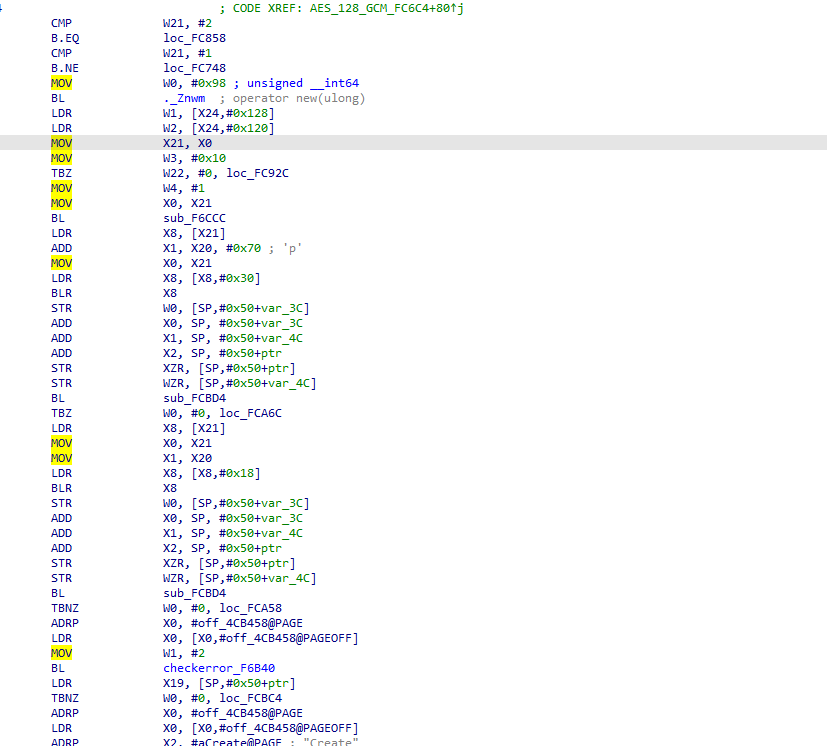

# IDAFrida
A simple IDA plugin  to generate FRIDA script.

1. Edit template for functions or you can use the default template.
2. Select functions you want to trace in function window
3.  Generate & inject


4. Instruction-level Hook Intercept Print Register Values  

  

5. Support for dynamically loaded SO libraries (only android) and support for intercepting initialization constructors in SO.

## default template
IDAFrida applies template to all selected functions and then generate a single frida script.  
```js
//[filename]->[funcname]
(function () {

    // @ts-ignore
    function waitForLoadLibraryNative(libName,callback){
        // @ts-ignore
        Interceptor.attach(Module.findExportByName(null, "dlopen"), {
            onEnter: function(args) {
                var pathptr = args[0];
                if (pathptr !== undefined && pathptr != null) {
                    // @ts-ignore
                    var path = ptr(pathptr).readCString();
                    // @ts-ignore
                    if (path.indexOf(libName) >= 0) {
                        this.findedLib = true;
                    }
                }
            },
            onLeave: function(retval) {
                if (this.findedLib) {
                    if(callback){
                        callback();
                        callback=null;
                    }
                }
            }
        })
    
        // @ts-ignore
        Interceptor.attach(Module.findExportByName(null, "android_dlopen_ext"), {
            onEnter: function(args) {
                var pathptr = args[0];
                if (pathptr !== undefined && pathptr != null) {
                    // @ts-ignore
                    var path = ptr(pathptr).readCString();
                    // @ts-ignore
                    if (path.indexOf(libName) >= 0) {
                        this.findedLib = true;
                    }
                }
            },
            onLeave: function(retval) {
                if (this.findedLib) {
                    if(callback){
                        callback();
                        callback=null;
                    }
                }
            }
        });
    }
    

    // @ts-ignore
    function print_arg(addr) {
        try {
            var module = Process.findRangeByAddress(addr);
            if (module != null) return ""+addr+"(pointer)   memory dump:\\n"+hexdump(addr) + "\\n";
            return ptr(addr) + "\\n";
        } catch (e) {
            return addr + "\\n";
        }
    }

    // @ts-ignore
    function hook_native_addr(funcPtr, paramsNum) {
        var module = Process.findModuleByAddress(funcPtr);
        try {
            Interceptor.attach(funcPtr, {
                onEnter: function (args) {
                    this.logs = "";
                    this.params = [];
                    // @ts-ignore
                    this.logs=this.logs.concat("So: " + module.name +"["+module.base+"]" + "  Method: [funcname] offset: " + ptr(funcPtr).sub(module.base) + "\\n");
                    for (let i = 0; i < paramsNum; i++) {
                        this.params.push(args[i]);
                        this.logs=this.logs.concat("this.args" + i + " onEnter: " + print_arg(args[i]));
                    }
                }, onLeave: function (retval) {
                    for (let i = 0; i < paramsNum; i++) {
                        this.logs=this.logs.concat("this.args" + i + " onLeave: " + print_arg(this.params[i]));
                    }
                    this.logs=this.logs.concat("retval onLeave: " + print_arg(retval) + "\\n");
                    console.log(this.logs);
                }
            });
        } catch (e) {
            console.log(e);
        }
    }
    let module=Module.findBaseAddress("[filename]");
    if(module==null){
        waitForLoadLibraryNative("[filename]",function(){
            // @ts-ignore
            hook_native_addr(Module.findBaseAddress("[filename]").add([offset]), [nargs]);
        });
    }else{
        // @ts-ignore
        hook_native_addr(Module.findBaseAddress("[filename]").add([offset]), [nargs]);    
    }
})();

```
Instruction-level HOOK intercept script templates  
```js

//[filename]->[address]: [registers]
(function () {

    // @ts-ignore
    function waitForLoadLibraryNative(libName,callback){
        // @ts-ignore
        Interceptor.attach(Module.findExportByName(null, "dlopen"), {
            onEnter: function(args) {
                var pathptr = args[0];
                if (pathptr !== undefined && pathptr != null) {
                    // @ts-ignore
                    var path = ptr(pathptr).readCString();
                    // @ts-ignore
                    if (path.indexOf(libName) >= 0) {
                        this.findedLib = true;
                    }
                }
            },
            onLeave: function(retval) {
                if (this.findedLib) {
                    if(callback){
                        callback();
                        callback=null;
                    }
                }
            }
        })

        // @ts-ignore
        Interceptor.attach(Module.findExportByName(null, "android_dlopen_ext"), {
            onEnter: function(args) {
                var pathptr = args[0];
                if (pathptr !== undefined && pathptr != null) {
                    // @ts-ignore
                    var path = ptr(pathptr).readCString();
                    // @ts-ignore
                    if (path.indexOf(libName) >= 0) {
                        this.findedLib = true;
                    }
                }
            },
            onLeave: function(retval) {
                if (this.findedLib) {
                    if(callback){
                        callback();
                        callback=null;
                    }
                }
            }
        });
    }


    // @ts-ignore
    function print_arg(addr) {
        try {
            var module = Process.findRangeByAddress(addr);
            if (module != null) return ""+addr+"(pointer)   memory dump:\\n"+hexdump(addr) + "\\n";
            return ptr(addr) + "\\n";
        } catch (e) {
            return addr + "\\n";
        }
    }

    // @ts-ignore
    function hook_native_addr(address, registers) {
        var module = Process.findModuleByAddress(address);
        try {
            Interceptor.attach(address, {
                onEnter: function (args) {
                    this.logs = "";
                    // @ts-ignore
                    this.logs=this.logs.concat("So: " + module.name +"["+module.base+"]" + "  Address: " + ptr(address).sub(module.base) + " [registers] " + "\\n");

                    if(registers!=null&&registers.trim()!==""){
                        for (let register of registers.trim().split(" ")) {
                            if(register==null||register.trim()=="")continue;
                            // @ts-ignore
                            this.logs=this.logs.concat("this.context." + register + " onEnter: " + print_arg(this.context[register.trim()]));
                        }
                    }
                    console.log(this.logs);
                }
            });
        } catch (e) {
            console.log(e);
        }
    }
    let module=Module.findBaseAddress("[filename]");
    if(module==null){
        waitForLoadLibraryNative("[filename]",function(){
            // @ts-ignore
            hook_native_addr(Module.findBaseAddress("[filename]").add([address]), "[registers]");
        });
    }else{
        // @ts-ignore
        hook_native_addr(Module.findBaseAddress("[filename]").add([address]), "[registers]");
    }
})();

```
